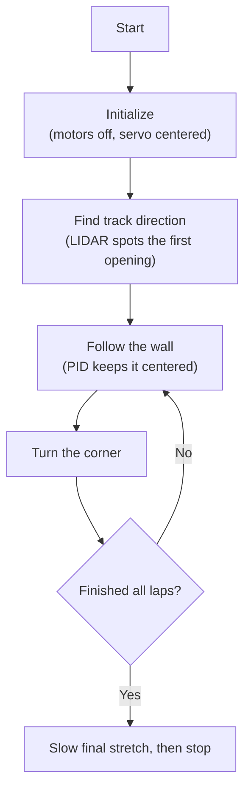
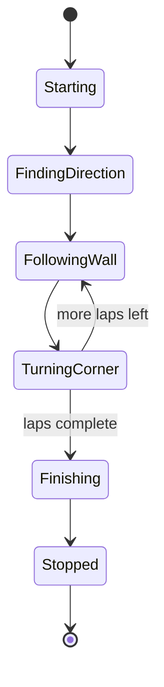

# WRO 2026 Future Engineers — Team CICSA
### National Final · Mexico · Season 2026

This is the official repository of **Team CICSA** for the WRO 2026 Future Engineers National Final. It contains all engineering materials for our self-driving vehicle: source code, wiring diagrams, 3D models, photos, and a full engineering journal documenting our design process.

---

## Follow us!

| Facebook | YouTube | Instagram |
|---------------|---------------|----------------|
| [](https://www.facebook.com/share/1A1hz6zQSn/) | [](https://www.youtube.com/@CICSA_Academia) | [](https://share.google/ZzGMFZOurGsjhWN2D) |

---

## Contents

**Folders**
- [📁 Models](./models/) — 3D printable parts (STL/F3D files)
- [📁 Other](./other/) — Engineering logbook and supplementary materials
- [📁 Schemes](./schemes/) — Wiring diagrams and electrical schematics
- [📁 Src](./src/) — All source code (Raspberry Pi Python — single-controller architecture)
- [📁 T-photos](./t-photos/) — Team photos (official + funny)
- [📁 V-photos](./v-photos/) — Vehicle photos (6 angles required)
- [📁 Video](./video/video.md) — Performance video links

**Index**
- [The team](#the-team)
- [The challenge](#the-challenge)
- [Robot overview](#robot-overview)
- [Mobility management](#mobility-management)
- [Power and sensor management](#power-and-sensor-management)
- [Software architecture](#software-architecture)
- [Obstacle management](#obstacle-management)
- [Systems thinking and engineering decisions](#systems-thinking-and-engineering-decisions)
- [Robot construction guide](#robot-construction-guide)
- [Engineering materials](#engineering-materials)
- [Performance videos](#performance-videos)
- [Digital engineering logbook](./other/README.md)
- [Final remarks and future work](#final-remarks-and-future-work)
- [References](#references)

---

## The team

**CICSA WRO 2026 — Future Engineers**

**Coach: Sergio Iván Hernández Ruiz**

Coach Sergio Iván provides the technical guidance and leadership required to keep Team CICSA on track. With extensive experience in robotics, he helps us navigate complex engineering challenges, refine our designs, and develop solutions that work in competitive environments. He has been director of the CICSA robotics academy since 2015 and has participated in WRO events since 2019.

---

**Gildardo Garcia** — Age 17 · Centro de Estudios Tecnológicos Industrial y de Servicios 128

Gildardo is responsible for the programming. He participated in the 2019 WRO Regional in Guadalajara in the primary category, where he obtained 2nd place. For the 2026 championship, he is responsible for programming and calibrating the sensors to ensure they function correctly.

---

**Sergio Amid Hernández González** — Age 20 · Software Engineering, Kuepa University

Sergio Amid leads the design and construction of the robot's 3D parts. He has participated in numerous competitions: 2019 WRO Regional in Guadalajara (1st place, preparatory category), 2024 WRO National in Mexicali (1st place, preparatory category), and represented Mexico at the WRO World Championship in Italy in 2024.

---

**Diego Pereida Arochi** — Age 18 · United States Air Force Avionics technician

Diego is responsible for PID control, motor/servo driver integration, and LIDAR sensor tuning, all running natively on the Raspberry Pi. He has competed in the FIRST Robotics Competition in both the United States and Mexico, achieved 1st place at WRO 2025 Mexicali, and alongside Sergio Amid represented Mexico at the WRO Italy 2024 Open World Championship. Currently in boot camp in San Antonio, Texas, and wasn't able to attend the national championship.

[📁 T-photos](./t-photos/)

[▲ Menu](#contents)

---

## The challenge

The WRO 2026 Future Engineers challenge requires teams to build a fully autonomous self-driving vehicle that competes in two rounds:

**Open Challenge:** The vehicle must complete three (3) laps on a track with randomly placed inner walls. Direction (clockwise or counter-clockwise) is revealed at competition time. No obstacles are present; the goal is clean navigation and lap time.

**Obstacle Challenge:** The vehicle must complete three (3) laps on the same track, this time with randomly placed red and green traffic sign pillars. The robot must:
- Pass to the **right** of a **red** pillar
- Pass to the **left** of a **green** pillar
- Not knock over any pillar
- After completing three laps, locate the magenta-bordered parking zone and execute a **parallel parking maneuver**

Scoring is based on: laps completed, obstacles respected, parking success, lap time, and documentation quality (engineering journal and this GitHub repository).

Our robot addresses these requirements using:
- **LIDAR** (RPLidar A1M8) for 360° distance mapping, sector-based wall following, and initial track-direction detection
- **Computer vision** (OpenCV on Raspberry Pi), used in the Obstacle Challenge program for traffic sign color detection and parking-zone location
- **PID control**, running natively in Python on the Raspberry Pi via `gpiozero`, for closed-loop steering during wall following
- **Hardware-timed PWM** (via the `pigpio` pin factory backing `gpiozero`) driving the servo and motor drivers from Raspberry Pi GPIO pins

For full game rules, visit the [WRO Official Site](https://wro-association.org/).

[▲ Menu](#contents)

---

## Robot overview

| Front | Back | Top |
|-------|------|-----|
|  |  |  |

| Bottom | Left | Right |
|--------|------|-------|
|  |  |  |

| Dimension | Value |
|-----------|-------|
| Length | ~230 mm |
| Width | ~145 mm |
| Height | ~190 mm |
| Weight | ~1174 g |

> **Note for judges:** Exact dimensions measured with calipers are documented in the engineering logbook. Robot must be under 300 mm × 200 mm per WRO vehicle regulations.


[▲ Menu](#contents)

---

## Mobility management

### Chassis and drive system

Our chassis employs a **rear-wheel drive** (RWD) system using a 400-RPM N20 motor, capped at 50% power to optimize battery life and improve LiDAR readings during turns—as higher speeds caused the LiDAR to struggle, thereby increasing the margin of error. The motor connects to the wheels via a differential to enable tighter turns, while the front end features an Ackermann steering system.

**Drive motor: N20 DC 12V, 400 RPM**

We selected the **N20 400 RPM variant** after testing 500 RPM and 1000 RPM versions of the same motor family. The higher-RPM motors caused the robot to overshoot turns and made PID tuning unstable at low speeds. We limit the motor power to just **200 rpm** (50% power) so that the robot has better PID control when turning in the shortest possible time and with the 2.09in diameter wheels, the linear speed is approximately:

```
2.09 in x 2.54 = 5.3086
R=5.3086 / 2=2.654
C=3.1416 x 5.3086 = 16.667
16.667 cm/rev x 200rev/min = 3335.4 cm/min
3335.4 / 60 = 55.59cm/s
linear speed 55.6 cm/s
```

This ~55.6 cm/s base speed provides enough controllability for the PID loop while still completing three laps in a competitive time. The N20 at 12V produces ~1.5 kg·cm of stall torque, sufficient to move our 1.179 kg robot including a safety margin for carpet-surface friction. In code, drive speed is set as a duty-cycle fraction (`target_velocity`, currently 0.5) rather than a raw RPM value.

**Steering: DIYmall 11KG Mini All-Metal Digital Servo**

The front axle uses the DIYmall 11KG coreless digital servo for steering. We chose an 11 kg·cm servo (rather than a lighter 3–5 kg·cm servo) because our front wheel assembly includes a 4mm-to-3mm steering shaft that creates mechanical friction. The heavier servo ensures fast, accurate response to PID commands without positional lag.

In software, the servo is driven through `gpiozero`'s `AngularServo` class (backed by the `pigpio` pin factory for hardware-timed pulses), configured for a ±90° mechanical range with 0.5–2.5 ms pulse widths and a software center of 0°. Two calibration constants trim this in code:
- `STEERING_LIMIT = 40` — clamps every requested steering command to ±40°, well inside the mechanical range, to protect the linkage.
- `CENTER_OFFSET = -20` — a fixed trim added after clamping, to correct for the assembly's slight physical off-center bias, rather than a separate one-time calibration script.

**Wheels: TRX4M 1/18 scale**

These wheels provide a balance between grip and rolling resistance. Their 2.09IN outer diameter was used in all speed calculations above.

**Turning radius estimation**

With our wheelbase of approximately 120mm and a software steering limit of ±40°, the minimum turning radius is approximately 165mm. This is well within the WRO track corner geometry.

### Steering and assembly photos

> See [📁 Models](./models/) for all 3D-printed STL files for the chassis plate, LIDAR tower, camera mount, and servo bracket.
> See [📁 V-photos](./v-photos/) for step-by-step assembly photos.

[▲ Menu](#contents)

---

## Power and sensor management

### Power system architecture
|Component | Operating Voltage	| Approx. Typical Current	| Approx. High/Maximum Current	| Approx. Power |
|-----------|-----------------|-------------|-------|-------|
|Raspberry Pi 4B	| 5 V	| 0.7–1.2 A	| ~1.5–2.0 A	| 3.5–10 W |
|Freenove Camera	| 5 V	| ~0.1–0.3 A	| ~0.3–0.5 A	| 0.5–2.5 W |
|LiDAR A1M8	| 5 V	| ~0.12–0.18 A	| ~0.2 A	| 0.6–1 W |
|Mini Servo, 24.3 lb, 180°	| 5 V	| ~0.2–0.8 A	| ~1.5–2.0 A*	| 1–10 W |
|N20 Motor , 400 RPM	| 11.1 V via DRV8871	| ~0.2–0.8 A	| ~1.5 A or higher*	| ~2–17 W |
|MPU 6050 | 5V | 3.9mA | 5mA | 13mA |

**Battery:** OVONIC 3S 11.1V, 2200 mAh

We use an 11.1V OVONIC 3S battery; although it nominally provides 12.6V, the voltage drops to 11.1V under load. It is capable of powering the N20 motor, as the motor primarily relies on current—which the 8871 driver supplies. A 2200 mAh capacity gives an estimated runtime of:1.11 hours if the motors are in a middle range of work and the processor is not demanding to much energy 

```
1.20+0.30+0.18+0.50+0.0039=2.1839
P5v = 5x2.18 = 10.9W
Pmotor = 11.1x0.80 = 8.88W
Ptotal = 10.9+8.88 = 19.78W
90% regulator efficiency = 21.98W
11.1V x 2.2Ah = 24.42Wh
Runtime = 24.42Wh/21.98W = 1.11H

```

Three competition rounds are estimated at under 10 minutes total, giving more than 5× safety margin.

**Voltage regulation:**

A DC-DC buck converter steps the 11.1V battery down to a stable 5V 5A rail for the Raspberry Pi, LIDAR, and servo. The motor drivers (DRV8871) take 12V directly from the battery to drive the N20 motors. The Raspberry Pi's own 3.3V GPIO pins drive the DRV8871 logic inputs and the servo PWM line directly — no intermediate microcontroller or level shifting is required, since the DRV8871's logic inputs and standard hobby servos both accept 3.3V signal levels.

**Wiring diagram:**


> See [📁 Schemes](./schemes/) for the full wiring schematic (Fritzing + PDF export).

Actual GPIO assignments:
- Battery (+) → DRV8871 (1) VM IN and Buck Converter IN
- Buck converter 5V OUT → Raspberry Pi USB-C, LIDAR 5V, Servo signal rail
- Raspberry Pi **GPIO 2, 3** → SCL and SDA 
- Raspberry Pi **GPIO 23** → Rear-motor DRV8871 IN1 (forward)
- Raspberry Pi **GPIO 22** → Rear-motor DRV8871 IN2 (backward) — this is the channel actually driving the robot
- Raspberry Pi **GPIO 12** (hardware PWM via `pigpio`) → Servo signal wire

Each axle's driver has its own independent forward/backward pin pair, which is what allows the front motor to be enabled or disabled purely in software.

### Sensor selection and placement

**RPLidar A1M8 (1 unit) — top-center mount**

The LIDAR provides 360° distance scanning at up to 8m range. We mount it at the top center of the robot so it has unobstructed line-of-sight to the track walls. It is the primary sensor for both the open-challenge wall-following algorithm and the initial track-direction detection at start-up, and it also supports close-range distance checks in the Obstacle Challenge program (parking-wall proximity).

Rather than reading raw single-beam distances, the code partitions each scan into three angular sectors and runs a small DSP pipeline before using the data (see [Software architecture](#software-architecture) for details):
- Front sector: −5° to +5°
- Left sector: 255° to 285°
- Right sector: 75° to 105°

**Freenove 8MP Camera (1 unit) — front center, elevated 80mm**

Used by the Obstacle Challenge program (not present in `wro2026_open_e.py`). The camera is mounted forward-facing at 80mm height, which gives a field of view that captures both the floor zone immediately ahead of the robot and traffic signs at their actual height on the track. Elevation was determined through testing: lower mounting caused the camera to see too much floor and miss vertical pillar colors; higher than 90mm clipped the near field.

**Sensor calibration:**

- LIDAR: Uses RPLidar SDK default factory calibration. Points below 150mm or above 6000mm are discarded as out-of-range/self-mapping noise (see DSP pipeline below).
- Steering: mechanical/electrical zero-offset is trimmed with the `CENTER_OFFSET` constant in code rather than a separate calibration script.
- Camera (Obstacle Challenge program): white balance set to auto; HSV color thresholds for red/green calibrated under venue lighting the day before the event and stored as constants in the config file.
  

[▲ Menu](#contents)

---

## Software architecture

### System overview

All decision-making and control runs in a single process on the **Raspberry Pi 4B (Python 3)**, using the `gpiozero` library for motor/servo control with its **pigpio pin factory** (set via `GPIOZERO_PIN_FACTORY = 'pigpio'`) so PWM pulses are generated with hardware timing (via the Pi's DMA controller) instead of in Python's own execution thread. This means servo and motor pulses stay precisely timed even if the Python control loop itself is briefly delayed by the OS scheduler.

This repository currently documents two separate programs:
- **`wro2026_open_e.py` (Open Challenge)** — LIDAR-only: sector-based distance sensing, DSP filtering, a start-up direction-detection routine, and a velocity-form PID wall follower. **No camera, no OpenCV, no obstacle/parking logic exists in this file.**
- **Obstacle Challenge program** — extends the same LIDAR/PID/motor foundation with the camera-based color detection and parking sequence described in [Obstacle management](#obstacle-management).

### Open Challenge — quick overview

These diagrams are meant to be walked through verbally in under a minute.

**Flow — what the robot does, in order:**



**States — what mode the robot is in:**



### Open Challenge — program flow

- **`initialize_system()`** — zeroes actuators (motors stopped, steering centered) before anything else runs.
- **LIDAR worker thread (`lidar_worker_thread`)** — a daemon thread that continuously reads scans from the RPLidar, splits each scan into front/left/right sectors by angle, runs the DSP pipeline below, and writes the resulting distances into shared global variables under a lock (`lidar_lock`) for the main thread to read.
- **`execute_start_sequence()`** — drives forward slowly while watching the left and right sectors. The first time one side reports a gap >1000mm while the front is ≤750mm, that's read as the track's first open corner; the robot executes a blind, timed 90° turn toward that opening and locks in which wall it will track (`control_direction`) for the rest of the run. Lap progress after that is tracked by counting a fixed number of turns rather than detecting a start/finish line.
- **`pid_wall_follower()`** — the closed-loop distance-holding routine, described in detail below.
- **`execute_90deg_left_turn()` / `execute_90deg_right_turn()`** — open-loop, timed turns (steer to ±40°, hold ~0.95s, recenter) used to negotiate each corner once the PID segment approaches it.
- **`terminate_system()`** — stops both motors and recenters steering; also runs on `KeyboardInterrupt` or any unhandled exception, so the robot fails safe.

### LIDAR signal processing (`filter_lidar_zone`)

Each angular sector's raw `(distance, angle)` points go through a small NumPy/SciPy pipeline before being used for control:

1. **Range filter** — discard points outside 150–6000mm (150mm excludes the robot's own chassis from self-mapping).
2. **Dropout interpolation** — missing/out-of-range samples are linearly interpolated (`np.interp`) from neighboring valid points rather than left as gaps.
3. **Median filter** — a wrapped median filter (window size 3) smooths the sector and rejects specular multi-path reflections.
4. **Step-discontinuity rejection** — the first-order difference between consecutive filtered points is checked against a 500mm gradient threshold; points that jump too fast between adjacent readings are dropped as likely noise.

The closest valid point in each sector is then taken as that sector's representative distance (front/left/right).

### PID controller (velocity-form, Raspberry Pi)

The actual PID implementation in `pid_wall_follower()` is a **velocity-form (incremental) PID**, not the textbook positional form:

```python
output = int(
    kp * (error - p_error)
    + (ki * error)
    + (kd * (error - (2 * p_error) + p_error_2))
    + p_output
)
output = min(max(output, -40), 40)
```

**Tuned values (current, in code):**
- `kp = 1.2` (proportional term, applied to the error delta)
- `ki = 0.0` (integral term currently disabled)
- `kd = 0.5` (derivative-of-error term, using a second-order error history)
- Sample time `T = 0.005s` — a ~200Hz control loop

The raw output is passed through `sanitize_control_signal()`, a rolling-median filter over the last 5 outputs: if a new value would jump more than 15° away from the recent median, it's replaced with that median instead, damping single-cycle spikes before they reach the servo. The sanitized value is what's actually sent to `set_steering_angle()`.

A safety early-exit ("CUELLO"/bottleneck check) is built into the long wall-follow segment: if the front sector reports ≤725mm after at least 250 cycles during the main 11-lap-loop call (not the short finishing call), the function exits early rather than continuing to drive toward a wall it's approaching too fast.

### Motor and steering actuation

- **`drive_forward_rwd()` / `drive_backward_rwd()` / `stop_rwd()`** — The motor is connected to the rear-wheel differential to provide mobility for the robot.
- **`set_steering_angle()`** — clamps the requested angle to `±STEERING_LIMIT` (40°), adds the `CENTER_OFFSET` trim (−20°), and writes the result to the `AngularServo`.

### Code structure

```
src/
└── raspberry_pi/
    ├── wro2026_open_e.py    # Open Challenge: state machine, LIDAR DSP, PID wall follower, motor/servo control
    └── (obstacle challenge program — vision/color detection, parking; separate file)
```

`wro2026_open_e.py` is a single self-contained script. Splitting it into separate modules (vision, LIDAR, PID, motor control) is on our list for a future cleanup pass.

[▲ Menu](#contents)

---

## Obstacle management

**Everything in this section describes the separate Obstacle Challenge program, which is not part of `wro2026_open_e.py`.** The Open Challenge script has no camera input and no color/parking logic.

# WRO 2026 Future Engineers - Obstacle Challenge

Autonomous vehicle developed for the *WRO 2026 Future Engineers Obstacle Challenge*. The system runs on a Raspberry Pi 4 and combines a 2D LiDAR, a camera, and an MPU6050 inertial sensor to follow walls, determine the driving direction, avoid colored traffic pillars, negotiate corners, recover from critical situations, and complete the required laps.
 
> Main program: wro2026_obstacle.py

## Project goals

The controller was designed around five priorities:

- Compliance with the WRO Future Engineers obstacle rules.
- Repeatable behavior with different battery levels.
- Sensor validation instead of acting on isolated measurements.
- A clear finite-state machine for testing and debugging.
- Recovery from temporary faults without immediately ending the run.

## Hardware

| Component | Purpose | Connection |
|---|---|---|
| Raspberry Pi 4 | Main computer and control coordinator | Central controller |
| RPLidar A1 | Front and lateral distances, wall geometry, open spaces, and corner detection | USB serial, normally /dev/ttyUSB0 |
| Freenove IMX219 camera | Red/green pillar detection and image position | Raspberry Pi CSI interface |
| MPU6050 | Angular velocity, accumulated heading, and 90-degree turn confirmation | I2C: SDA GPIO 2, SCL GPIO 3 |
| Ackermann steering servo | Front steering angle | GPIO 12 |
| Rear DC motor and driver | Forward and reverse movement | GPIO 23 and GPIO 22 |
| MPU6050 | Know the robot position | GPIO 2 and GPIO 3 |

The LiDAR convention used by the software is:

- 0°: front
- 90°: right
- 180°: rear
- 270°: left

Positive steering angles turn left; negative angles turn right.

## System architecture

The sensors run in independent background threads. Each thread publishes its newest measurement with a sequence number and timestamp. A single fixed-rate controller reads the latest snapshots at *40 Hz*, validates them, executes the active state, and sends commands to the steering servo and rear motor.

mermaid
flowchart TD
    CAM["Camera<br/>pillar color, x, bottom, area"]
    LIDAR["RPLidar A1<br/>front, left, right, wall angle"]
    MPU["MPU6050<br/>heading and angular change"]

    SNAP["Time-stamped sensor snapshots"]
    VALID["Validation and filtering"]
    FSM["40 Hz finite-state controller"]
    ACT["Steering servo and rear motor"]
    TELE["CSV telemetry"]

    CAM --> SNAP
    LIDAR --> SNAP
    MPU --> SNAP
    SNAP --> VALID --> FSM
    FSM --> ACT
    FSM --> TELE


## How each sensor is used

### RPLidar A1

The LiDAR is the main geometric sensor. Its scans are divided into angular sectors to obtain front, left, and right distances. Recent measurements are filtered with medians and checked for minimum point count, age, physical range, and impossible jumps.

It supports:

- Corridor centering before the driving direction is known.
- Outer-wall following during normal sections.
- Selection of the closest reliable wall during pillar avoidance.
- Detection of the front wall before a corner.
- Verification that enough space exists during reverse and corner exit.
- Recovery when a distance becomes critical or the LiDAR stops updating.

### Camera

The IMX219 camera detects red and green traffic pillars. The image pipeline applies a region of interest, color segmentation, blob filtering, and geometric plausibility checks.

For every candidate, the controller considers:

- Color: red or green.
- Horizontal position (x).
- Bottom position in the image.
- Blob area and shape.
- Agreement between two independent distance estimates.

The color determines the legal passing side:

| Pillar | Robot passes on | Pillar remains on |
|---|---|---|
| Red | Right | Left side of the robot |
| Green | Left | Right side of the robot |

A short hold period prevents the maneuver from ending because of one missed camera frame. After the pillar disappears, the controller completes the crossing using LiDAR distance and MPU6050 heading.

### MPU6050

The MPU6050 is calibrated while the robot is completely stationary. The Z-axis gyroscope is filtered and integrated to estimate accumulated heading.

It is used to:

- Maintain a heading reference during cascaded wall control.
- Measure the angular displacement produced while avoiding a pillar.
- Apply counter-steering after the pillar has been passed.
- Confirm each 90-degree corner by heading instead of time alone.
- Compare the expected total heading with the number of completed corners.

Using heading feedback makes the corner maneuver less dependent on motor speed or battery voltage.

## Finite-state machine

mermaid
stateDiagram-v2
    [*] --> START
    START --> DETERMINE_DIRECTION: sensors ready
    DETERMINE_DIRECTION --> REVERSE: first corner detected

    STRAIGHT --> PILLAR: valid pillar detected
    PILLAR --> STRAIGHT: pillar passed
    STRAIGHT --> REVERSE: corner confirmed

    REVERSE --> TURN: reverse clearance reached
    TURN --> EXIT_TURN: 90-degree turn confirmed
    EXIT_TURN --> STRAIGHT: more corners required
    EXIT_TURN --> FINISHED: final corner completed

    DETERMINE_DIRECTION --> RECOVER: recoverable condition
    STRAIGHT --> RECOVER: recoverable condition
    PILLAR --> RECOVER: recoverable condition
    REVERSE --> RECOVER: recoverable condition
    TURN --> RECOVER: recoverable condition
    EXIT_TURN --> RECOVER: recoverable condition
    RECOVER --> DETERMINE_DIRECTION: retry initial approach
    RECOVER --> STRAIGHT: retry section
    RECOVER --> REVERSE: retry corner
    FINISHED --> [*]


| State | Main responsibility | Principal sensors |
|---|---|---|
| START | Initialize actuators, telemetry, and sensor threads | All |
| DETERMINE_DIRECTION | Center the robot and identify the outer wall at the first corner | LiDAR, camera, MPU6050 |
| STRAIGHT | Follow the active reference wall and search for the next event | LiDAR, camera, MPU6050 |
| PILLAR | Cross to the legal side and pass the detected pillar | Camera, LiDAR, MPU6050 |
| REVERSE | Create enough space before turning | LiDAR |
| TURN | Execute and confirm the 90-degree corner | MPU6050, LiDAR fallback |
| EXIT_TURN | Leave the corner and restore normal motion | LiDAR |
| RECOVER | Reverse, reposition, and retry a recoverable state | LiDAR, active-state context |
| FINISHED | Stop motion, close telemetry, and stop threads | All |

## Development process

### 1. Basic propulsion and steering

Development started by calibrating the rear motor, steering center, and asymmetric left/right steering limits. Braking was improved with a short opposite-direction motor pulse to reduce inertia and make stopping distance more repeatable.

### 2. LiDAR wall following

The first autonomous behavior used the RPLidar A1 to follow the outer wall. Raw scans were divided into sectors and filtered. A fixed-rate loop was then introduced so control timing no longer depended on the LiDAR scan rate.

The straight controller evolved into a cascaded structure:

1. Lateral distance error generates a target heading offset.
2. MPU6050 heading error generates the steering command.
3. Steering limits and critical-distance protections constrain the result.

### 3. Camera-based pillar detection

Red and green segmentation was added using the Raspberry Pi camera. Early tests showed that color alone could create false detections, so the detector was expanded with minimum area, aspect ratio, bounding-box fill, region-of-interest, temporal confirmation, and geometric plausibility filters.

Two image measurements estimate pillar distance independently: blob area and vertical bottom position. A candidate is accepted only when both estimates are reasonably consistent.

### 4. Pillar avoidance

The first avoidance controller always referenced the outer wall. That became unreliable when the robot crossed away from it, especially when a black wall produced few LiDAR returns at long range.

The final strategy follows one rule: *during avoidance, use the wall on the side toward which the robot is crossing*. This keeps the reference wall closer and gives the LiDAR a more reliable surface.

The maneuver continues briefly after the camera loses sight of the pillar. LiDAR distance controls the remaining lateral crossing, while the MPU6050 measures the heading change and guides the counter-steering phase.

### 5. MPU6050 heading control

Time-based turns varied with battery voltage and surface conditions. The MPU6050 was therefore added to measure heading directly. The software calibrates gyroscope bias at startup, filters vibration, learns or applies the rotation sign, and confirms the corner when the accumulated change reaches the target angle.

### 6. Recovery and robustness

Instead of aborting after every sensor anomaly, the controller classifies selected faults as recoverable. Recovery brakes the robot, chooses a safe reverse steering direction from the obstacle location, reverses until space is available, centers the steering, and retries the interrupted state.

Additional protections include:

- Sensor age and health checks.
- LiDAR jump rejection held for the complete scan.
- Maximum valid wall distance.
- Critical front and lateral distances.
- Camera outage speed limitation.
- Maximum duration for blind crossing phases.
- Limited recovery and corner retry counts.
- CSV telemetry for post-run analysis.

### 7. Direction detection and complete-lap sequence

At startup, the robot does not yet know which wall is outside. It centers between both walls and approaches the first corner. The side that opens identifies the inner area of the track; the opposite side becomes the outer reference wall. The controller then executes the first corner and repeats straight-section and corner states until the configured number of corners is complete.

## Software requirements

- Raspberry Pi OS with Python 3
- gpiozero
- pigpio daemon and Python interface
- opencv-python / Raspberry Pi OpenCV package
- picamera2
- smbus2
- rplidar (rplidar-roboticia compatible API)


## Running the controller

Start the pigpio service before a hardware run:

bash
sudo systemctl start pigpiod


Run a normal three-lap session:

bash
cd /home/pi/wro2026/wro2026_obstacle
source /home/pi/rplidar_env/bin/activate
python3 wro2026_obstacle_english.py


Run one lap for testing:

bash
python3 wro2026_obstacle_english.py --vueltas 1


Run the logic tests without hardware:

bash
python3 wro2026_obstacle_english.py --autotest


Run the simulator when the companion simulation module is available:

bash
python3 wro2026_obstacle_english.py --sim


Disable telemetry if required:

bash
python3 wro2026_obstacle_english.py --sin-telemetria


> Keep the robot completely still during MPU6050 calibration. For bench testing, raise the driven wheels or disconnect motor power until the steering and sensor checks are complete.

## Telemetry

During a run, the controller can save CSV rows containing:

- Current state and corner number.
- Front, left, and right LiDAR distances.
- Active reference wall and target distance.
- Steering and speed commands.
- Pillar color, horizontal position, bottom position, and area.
- MPU6050 heading and relative heading.
- LiDAR and camera health flags.

These logs were essential for comparing runs, identifying false measurements, adjusting thresholds, and verifying whether a failure came from perception, control, or mechanical behavior.

# Code challenge flowchart

### 1. Simplified Program Flow

The camera, LiDAR, and MPU6050 operate concurrently. Each sensor thread publishes its latest time-stamped measurement. The 40 Hz Finite-State Machine (FSM) reads and validates these sensor snapshots before determining the vehicle's steering and speed commands.

Figure 1. Simplified execution flow.


### 2. Finite-State Machine

The FSM connects each sensor to the states where it is primarily used:

Camera: Pillar recognition and passing-side selection.
LiDAR: Wall following, clearance monitoring, and corner detection.
MPU6050: Heading stabilization and confirmation of the 90-degree turn.

Figure 2. Main FSM states and transitions.


### 3. State Summary

State	Purpose
START	Initialize actuators, telemetry, MPU6050, LiDAR, and camera.
DETERMINE_DIRECTION	Center the vehicle in the corridor, handle an early pillar, and identify the outer wall at the first corner.
STRAIGHT	Follow the active reference wall and monitor the next corner.
PILLAR	Select the legal passing side and control the crossing using camera, LiDAR, and heading information.
REVERSE	Move backward from the corner to create sufficient turning space.
TURN	Execute and confirm the 90-degree turn, primarily using MPU6050 heading data.
EXIT_TURN	Straighten the steering and safely exit the corner.
RECOVER	Reverse and reposition the vehicle after a recoverable sensor or distance condition, then retry the maneuver.
FINISHED	Brake, center the steering, save telemetry, and stop all sensor threads.

### 4. Control-Cycle Logic

The control loop runs at 40 Hz and follows these steps:

Read the newest sensor snapshots without waiting for a new LiDAR scan.
Validate sensor age, measurement range, geometric plausibility, and detect impossible measurement jumps.
Select the reference wall:
Outer wall during normal driving.
Passing-side wall during pillar avoidance.
Compute the appropriate steering and speed commands.
Apply safety limits to the control commands.
Record telemetry data.
Repeat the cycle at 40 Hz.

This architecture allows the vehicle to process sensor data concurrently while maintaining a deterministic control cycle through the FSM.

[▲ Menu](#contents)

---

## Systems thinking and engineering decisions

### Why gpiozero + pigpio (not a raw pigpio API or a separate ESP32)?

Our 2025 platform split real-time control onto a dedicated ESP32 microcontroller to avoid Linux scheduling jitter. For 2026 we removed the ESP32 to simplify the electronics stack, reduce weight, cut cost, and remove a UART link and an extra power rail as potential failure points.

We still needed to solve the jitter problem, so instead of bit-banging PWM in Python, our motor and servo control goes through `gpiozero`'s `Motor` and `AngularServo` classes, configured to use the `pigpio` pin factory. `pigpio` generates the actual pulses via the Raspberry Pi's DMA hardware, so timing stays precise regardless of what the Python interpreter is doing at that instant, while `gpiozero` gives us a simpler, higher-level API than calling the pigpio daemon's socket interface directly. The trade-off we accepted is a lower decision-update rate in our own control loop versus a dedicated microcontroller, which we judged acceptable given our top speed of ~6.6 cm/s and the track's corner geometry.

**Alternative considered:** Keeping the ESP32. Rejected for 2026 because the added wiring complexity and UART maintenance burden outweighed the timing benefit at our modest drive speed.

### Why LIDAR + camera (not ultrasonic sensors)?

Our previous design used two ultrasonic sensors for close-range obstacle avoidance and parking alignment, angled outward from center. In testing this season we found the LIDAR's minimum range (15cm) combined with its full 360° coverage gave us close-range awareness that was accurate enough to drop the ultrasonic sensors entirely for the Open Challenge. This simplified our wiring, freed up current budget on the 5V rail, and removed two more components that could fail or drift out of calibration.

**Alternative considered:** Keeping ultrasonic sensors purely as a parking-alignment backup. Rejected because our practice runs showed the LIDAR's side-sector readings were consistently within a few millimeters of the ultrasonic readings they were replacing, making the redundancy unnecessary for our current track speed.

**Alternative considered (open challenge):** Single-camera line following. Rejected because the WRO 2026 track uses no floor markings — walls are the only navigational reference.

### Why DRV8871 motor driver (not L298N or DRV8833)?

The DRV8871 was chosen over the L298N we used in 2025 for three key reasons. First, efficiency: the DRV8871 uses N-channel MOSFETs and loses only ~5% of power as heat, compared to the L298N's ~30% loss — this means less thermal management and longer battery life. Second, built-in current regulation: the DRV8871 has integrated current sensing that limits peak current to 3.6A, protecting our N20 motors from stall damage without external circuitry. Third, size: the DRV8871 module is significantly smaller and lighter than the L298N, which matters for our weight budget.

We considered the DRV8833 (dual-channel, 1.5A/channel) but rejected it because our N20 motors draw up to 1.5A stall each — right at the DRV8833's limit, with no safety margin. The DRV8871's 3.6A headroom is much more comfortable. Each DRV8871 module drives one motor channel (front or rear), with independent forward/backward GPIO pin pairs, and its logic inputs are driven directly from Raspberry Pi GPIO with no separate microcontroller needed.

### Design iteration history

| Version | Key change | Reason / Result |
|---------|-----------|----------------|
| v1.0 | Off-shelf 4WD chassis, breadboard wiring | Testing baseline — high vibration, unstable sensors |
| v1.1 | Replaced breadboard with soldered protoboard | Eliminated loose-connection faults |
| v2.0 | Custom 3D-printed top plate, camera moved to front | Reduced vibration noise, improved camera FOV |
| v2.1 | Added LIDAR tower mount | LIDAR previously taped to chassis — now rigid and repeatable |
| v3.0 | (Current) Removed ESP32 and ultrasonic sensors, consolidated all control onto the Raspberry Pi via `gpiozero`/`pigpio`, full cable management, dedicated power rails | Simplified wiring, cut cost and weight, eliminated UART maintenance and ground-loop noise from the removed ultrasonic sensors and delete the AWD traction for a RWD|

### Risk analysis

| Risk | Likelihood | Mitigation |
|------|-----------|------------|
| Camera loses detection under venue lighting (Obstacle Challenge) | Low | HSV thresholds recalibrated on-site the day before the event |
| PWM jitter from Python/OS scheduling | Low | `gpiozero`'s `pigpio` pin factory generates pulses via DMA hardware, independent of Python loop timing |
| LiPo battery depleted mid-round | Low | Battery checked at >80% before each round; runtime >> round duration |
| Front-motor wiring present but software-disabled could be flagged at inspection | Medium | Team evaluating physically removing/disconnecting the front motor before finals |
| Fixed-count (11-turn) lap loop rather than start-line detection could mis-navigate on an unexpected track layout | Medium | Practiced against the expected track geometry; a start-line/lap-crossing detector is on our future-work list |
| Close-range blind spot (LIDAR min. range 15cm) | Low | Approach speed reduced near walls; early-exit ("CUELLO") check stops the long wall-follow segment before a too-close approach |

[▲ Menu](#contents)

---

## Robot construction guide

### Component list

| Component | Quantity | Description | Link |
|-----------|----------|-------------|------|
| Slamtec RPLIDAR A1M8 360° 2D LIDAR Scanner | 1 | 360° LIDAR for wall following and close-range checks | [Amazon](https://www.amazon.com/dp/B07TJW5SXF) |
| N20 DC Gear Motor 12V 400RPM Metal Gearbox | 1 | Rear drive | [Amazon](https://www.amazon.com/dp/B0DB26SYNP) |
| HobbyPark Brass 1.0 Beadlock Wheels & Tires for 1/18 TRX4M | 4 | Brass beadlock wheels + tires + foam inserts | [Amazon](https://www.amazon.com/dp/B0C3MNX4K7) |
| PATIKIL U-Joint Steering Shaft Coupler 4mm to 3mm | 1 | Universal joint connects servo to front axle | [Amazon](https://www.amazon.com/dp/B0FWJGLZ9V) |
| RC Front & Rear Axle Housing Set (TRX4M compatible) | 2 | Ackermann steering linkage | [Amazon](https://www.amazon.com/dp/B0CW2HFT57) |
| Raspberry Pi 4B (4GB) | 1 | Main compute / vision / control unit | [Amazon](https://a.co/d/084kiOZ5) |
| DIYmall 11KG Mini All-Metal Digital Servo (360° Coreless) | 1 | Front-wheel steering | [Amazon](https://www.amazon.com/dp/B0DX1XG18Y) |
| DRV8871 H-Bridge DC Motor Driver | 1 | PWM motor control, 3.6A peak, one per motor channel | [MercadoLibre](https://www.mercadolibre.com.mx/modulo-driver-drv8871-puente-h-control-motor-36a-65v-a-45v/up/MLMU3232504497) |
| Freenove 8MP Camera | 1 | Traffic sign color detection (Obstacle Challenge program) | [Amazon](https://www.amazon.com/dp/B0BZYPBS17) |
| OVONIC 3S 11.1V 2200mAh LiPo Battery | 1 | Main power source | [Amazon](https://www.amazon.com/dp/B0D8SZRGJT) |
| DC-DC Buck Converter 5V 5A | 1 | Steps 11.1V down to 5V rail | [Amazon](https://www.amazon.com/dp/B0D7MR48LB) |
| 3×120 Dupont Jumper Cables 40cm (M-M, M-F, F-F) | 3 packs | Wiring between all modules | [MercadoLibre](https://articulo.mercadolibre.com.mx/MLM-3643032042-3pzs-120-jumper-cable-dupont-wire-40cm-cable-para-protoboard-_JM) |
| Velstron 1,112-piece M3/M4/M5/M6 Screws, Bolts & Nuts Kit | 1 | Chassis fasteners and assembly hardware | [MercadoLibre](https://www.mercadolibre.com.mx/kit-surtido-de-1112-piezas-de-tornillos-pernos-y-tuercas/up/MLMU582984840) |
| 5-Pack Rocker Switch ON/OFF Red 2-Pin 127V/10A | 1 | In-line with battery positive | [MercadoLibre](https://www.mercadolibre.com.mx/5-pzas-interruptor-onoff-rojo-2-pines-127v10a-rojo/p/MLM59606936) |
| GY521 MPU6050 3-axis gyroscope | 1 | Help the robot to know the position of where he is | [AMAZON](https://www.amazon.com/gp/product/B0CRVR1P66/ref=ox_sc_act_title_1?smid=A1MYENKL68XMV9&psc=1). |

**Estimated total cost: ~$325 USD**

### Pre-installation checks

**Servo motor:** Connect to the Raspberry Pi (via `gpiozero`/`pigpio`) and confirm the software `CENTER_OFFSET` trim before mounting. Physical center must match the trimmed electrical center or the robot will always drift to one side.

**DC motors:** Apply 12V directly and confirm rotation direction matches expected forward for both the rear (active) and front (currently disabled) channels. The red terminal dot indicates positive.

### Electrical wiring — servo motor

| Wire color | Function |
|------------|---------|
| Brown | GND |
| Red | VCC (5V) |
| Yellow | PWM signal from Raspberry Pi GPIO 12 (`gpiozero`/`pigpio`) |

### Electrical wiring — motor drivers (as implemented)

| GPIO pin | Function |
|----------|---------|
| 23 | Rear motor DRV8871 IN1 (forward) — active |
| 22 | Rear motor DRV8871 IN2 (backward) — active |
| 12 | Servo PWM signal |

**Power switch:** Wired in series with the battery positive lead. Always switch off when not in use to protect the LiPo.

### Safety notes

- Do not operate in humid environments
- Verify polarity before connecting battery
- Never short the LiPo terminals — use a fused connector
- Double-check all wiring before first power-on after any reassembly

### Board mounting

The 3D-printed top plate has mounting holes for:
- Raspberry Pi 4B (standard 58mm hole spacing)
- Camera bracket (front-center)
- LIDAR tower (center, elevated ~60mm above chassis)

For all 3D files: [📁 Models](./models/)

[▲ Menu](#contents)

---

## Engineering materials

This repository contains all engineering materials for Team CICSA's self-driving vehicle competing in WRO Future Engineers 2026.

| Quantity | Component | Link |
|----------|-----------|------|
| 1 | Raspberry Pi 4B (4GB) — ~$55 | [Amazon](https://a.co/d/084kiOZ5) |
| 1 | Freenove 8MP Camera — ~$14 | [Amazon](https://www.amazon.com/dp/B0BZYPBS17) |
| 1 | DRV8871 H-Bridge DC Motor Driver — ~$4 | [MercadoLibre](https://www.mercadolibre.com.mx/modulo-driver-drv8871-puente-h-control-motor-36a-65v-a-45v/up/MLMU3232504497) |
| 1 | Slamtec RPLIDAR A1M8 360° 2D LIDAR — ~$99 | [Amazon](https://www.amazon.com/dp/B07TJW5SXF) |
| 1 | N20 DC Gear Motor 12V 400RPM — ~$8 | [Amazon](https://www.amazon.com/dp/B0DB26SYNP) |
| 1 | DIYmall 11KG Mini All-Metal Digital Servo — ~$16 | [Amazon](https://www.amazon.com/dp/B0DX1XG18Y) |
| 4 | HobbyPark Brass Beadlock Wheels & Tires 1/18 TRX4M — ~$20/set | [Amazon](https://www.amazon.com/dp/B0C3MNX4K7) |
| 1 | PATIKIL U-Joint Steering Shaft Coupler 4mm→3mm — ~$8 | [Amazon](https://www.amazon.com/dp/B0FWJGLZ9V) |
| 2 | RC Front & Rear Axle Housing Set (TRX4M) — ~$12 | [Amazon](https://www.amazon.com/dp/B0CW2HFT57) |
| 1 | OVONIC 3S 11.1V 2200mAh LiPo Battery — ~$25 | [Amazon](https://www.amazon.com/dp/B0D8SZRGJT) |
| 1 | DC-DC Buck Converter 5V 5A — ~$10 | [Amazon](https://www.amazon.com/dp/B0D7MR48LB) |
| 3 packs | 3×120 Dupont Jumper Cables 40cm — ~$6/pack | [MercadoLibre](https://articulo.mercadolibre.com.mx/MLM-3643032042-3pzs-120-jumper-cable-dupont-wire-40cm-cable-para-protoboard-_JM) |
| 1 | Velstron 1,112-piece M3/M4/M5/M6 Hardware Kit — ~$18 | [MercadoLibre](https://www.mercadolibre.com.mx/kit-surtido-de-1112-piezas-de-tornillos-pernos-y-tuercas/up/MLMU582984840) |
| 1 | 5-Pack Rocker Switch ON/OFF Red 2-Pin 127V/10A — ~$4 | [MercadoLibre](https://www.mercadolibre.com.mx/5-pzas-interruptor-onoff-rojo-2-pines-127v10a-rojo/p/MLM59606936) |
| 1 | GY521 MPU6050 3-axis gyroscope - ~$4 | [AMAZON](https://www.amazon.com/gp/product/B0CRVR1P66/ref=ox_sc_act_title_1?smid=A1MYENKL68XMV9&psc=1). |

**Estimated total cost: ~$375 USD**

### Component function summary

| Component | Function |
|-----------|---------|
| Raspberry Pi 4B | State machine, LIDAR processing, PID control, and PWM output (via `gpiozero`/`pigpio`) — all navigation logic in one controller |
| Freenove Camera | Traffic sign color detection via OpenCV (Obstacle Challenge program only) |
| Slamtec RPLIDAR A1M8 | 360° sector-based wall distance mapping for navigation and direction detection |
| DRV8871 Driver | Efficient H-bridge motor control, driven directly from Pi GPIO |
| N20 DC Gear Motor| Rear-wheel drive active |
| DIYmall 11KG Servo | Front-wheel Ackermann steering, driven via `gpiozero`'s `AngularServo` (pigpio-backed) |
| HobbyPark Brass Wheels (×4) | High-grip 1.0" beadlock wheels for 1/18 TRX4M chassis |
| PATIKIL U-Joint Coupler | 4mm-to-3mm universal joint connecting servo shaft to front axle |
| RC Front & Rear Axle Set | Steering axle housings |
| OVONIC 3S 2200mAh LiPo | Main power (11.1V, ~55 min runtime) |
| Buck Converter 5V | Regulated 5V rail for Pi, LIDAR, servo |
| Dupont Jumper Cables | All inter-module wiring connections |
| M3/M4/M5/M6 Hardware Kit | Chassis assembly fasteners (screws, bolts, nuts, washers) |
| Rocker Switch ON/OFF Red 2-Pin | Power control switch in-line with battery positive |
| GY521 MPU6050 3-axis gyroscope | Know the robot position at all time |

### Software and libraries

| Platform | Language | Libraries | Role |
|----------|---------|----------|------|
| Raspberry Pi 4B | Python 3 | `rplidar` | LIDAR scan parsing |
| | | `gpiozero` (pigpio pin factory) | Hardware-timed motor and servo control |
| | | `numpy`, `scipy.ndimage` | LIDAR DSP: interpolation, median filtering, gradient checks |
| | | Custom velocity-form PID | Wall-following steering control |
| | | OpenCV | Color detection, contour analysis — Obstacle Challenge program only |

[▲ Menu](#contents)

---

## Performance videos

> Video links are documented in [📁 Video](./video/video.md).

- Open Challenge — practice run (3 laps complete)
- Obstacle Challenge — practice run (3 laps + parking)
- Robot assembly time-lapse

[▲ Menu](#contents)

---

## Final remarks and future work

We are proud of how Team CICSA's robot evolved over this season. Starting from a vibration-prone breadboard prototype, we arrived at a stable, reproducible platform with clean cable routing, rigid sensor mounting, and a well-tuned PID controller. Consolidating everything onto a single Raspberry Pi — with `gpiozero`'s pigpio-backed PWM handling hardware timing — let us simplify our wiring and cut both cost and weight versus our previous ESP32 + ultrasonic setup, and we would recommend this simplified architecture to future teams building at a similar drive speed.

**What worked well:**
- The LIDAR-based wall following is robust to lighting changes and requires no floor markings
- The DSP pipeline (interpolation + median filter + gradient rejection) meaningfully cleaned up noisy LIDAR sectors before they reached the PID loop
- `gpiozero`'s pigpio pin factory kept servo and motor pulses stable even without a dedicated microcontroller

**What we would improve with more time:**
- Replace the fixed 11-turn loop with actual start/finish-line detection so lap counting is robust to any track layout, not just the practiced one
- Finalize the drivetrain as a true single-motor build (physically, not just via software flag) to remove any ambiguity around the single-drive-axle rule
- Implement a Kalman filter to fuse LIDAR and camera-derived distance estimates for more accurate position estimation
- Add an IMU (MPU6050) to detect and correct for wheel slip during sharp corners
- Improve the parking algorithm to use pixel-level magenta zone detection rather than distance-based thresholding
- Add a web dashboard on the Pi for real-time parameter tuning over Wi-Fi during practice sessions

We thank Coach Sergio Iván for his support and guidance throughout the season, and CICSA Academy for providing the resources and space to build and test our robot.

[▲ Menu](#contents)

- This is a small circuit made in Proteus showing the wiring layout described above. We didn't have every exact part on hand for the simulation, so some components are represented with similar substitute parts under different labels.


---

## References

1. WRO 2026 Future Engineers General Rules — https://wro-association.org/wp-content/uploads/WRO-2026-Future-Engineers-Self-Driving-Cars-General-Rules.pdf
2. WRO 2026 Documentation Rubric — https://wro-association.org/wp-content/uploads/WRO-2026-Future-Engineers-Documentation-Rubric.pdf
3. RPLidar A1M8 SDK — https://github.com/Slamtec/rplidar_sdk
4. OpenCV HSV color detection — https://docs.opencv.org/4.x/df/d9d/tutorial_py_colorspaces.html
5. Ziegler–Nichols PID tuning method — Ziegler, J.G. & Nichols, N.B. (1942). *Transactions of the ASME*, 64, 759–768.
6. gpiozero documentation — https://gpiozero.readthedocs.io/
7. pigpio library documentation — https://abyz.me.uk/rpi/pigpio/
8. WRO Future Engineers Getting Started Guide — https://world-robot-olympiad-association.github.io/future-engineers-gs/

[▲ Menu](#contents)
